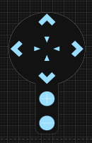
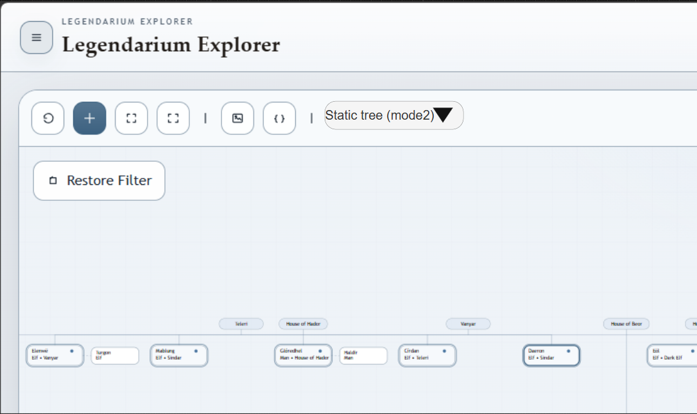

1. y offset
   1. häuser
   2. einzelne personen
2. x reihenfolge
   1. was in welcher reihenfolge, sollte nicht random, oder alphapetisch sein, sondern thematisch einstellbar
3. tree logik als komplett unabhhängige einheit / unit entkapseln, ui soll unabhängig sein
   1. schlauerer mechansmus. auf objekt (person, evtl relation?) ein order attribut hinzufügen. sobald die tree render logik entscheiden muss welche person in welcher reihenfolge auf der entsprechenden stufe angezeigt werden soll, wird order berücksichtigt.
      1. optional, wenn leer alphabetisch
      2. auch für häuser
4. neues prinzip bei häuser
   1. ist nicht immer startpunkt, je nachdem ergibt sich später ein neues haus (edain > nummenorer > dunedain
5. Startpunkt der häuser ist aktuell zu nahe aufeinander.
   1. der startpunkt der häuser sollte berücksichtigen , wie breit der baum schlussendlich wird, damit die startpunkte der häuser nicht zu nahe sind. dann sollte es weniger überlappende und verwirrende verbindungen geben.
6. Preview3:
   1. Preview3 soll für dieses update verwendet werden. In einer früheren session wurde die tree logik / render von den restlichen entkoppelt worden sein.
      1. Dies vorab prüfen ob dies korrekt ist.
7. Zukünfttig sehe ich aus fachsicht die anforderung für die tree render logik durch den user anpassen zu lassen
   1. 1 mode, jetziges verhalten, der nodes, relations etc
      1. hier wird bei einem paar in deren stammbaum jeweils der partner angezeigt
      2. bei der männlichen seite wird der stammbaum weitergeführt
         1. bei der weiblichen seite ist jeweils nur ein zus. feld mit dem partner
            1. es wäre gut, wenn dies klickbar ist um zum partner zu springen und dort die linie weiter zu verfolg
   2. 2 mode: blutlinie starr, heirat zwischen 2 personen wird durch eine direkte verbindung angezeigt. diese linie bewirkt nicht, dass andere boxen deswegen ausweichen
   3. 3 mode, nicht sicher ob das programmatisch gelöst werden kann, aber es wäre wünschenswert wenn sich 2 häuser via heirat vermählen, dass die beiden stammbäume "kombiniert werden"

UI

1. Tree navigator
   1. Zoom
   2. move top, down, left, right
   3. collabsable / hide / unhide
   4. aus bestehenden standard libraries bevorzugt

2. Mode switch
3. 
